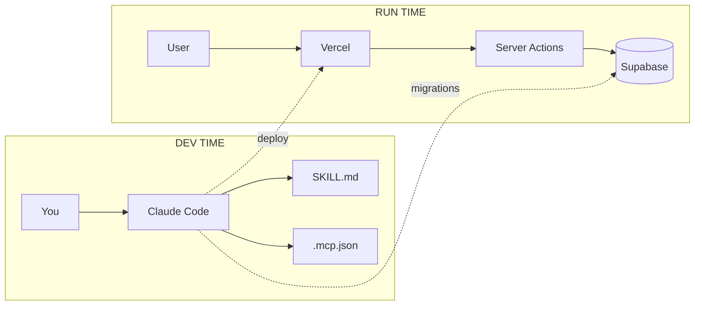
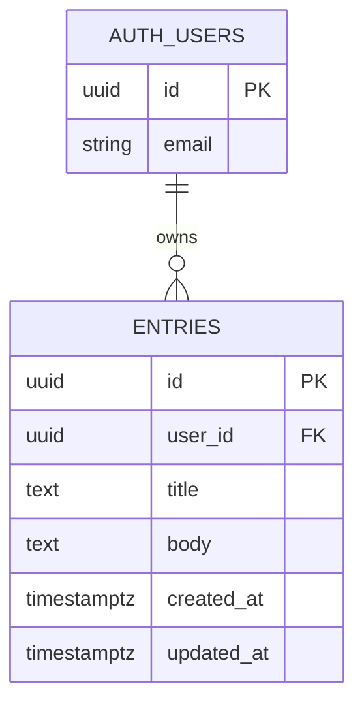
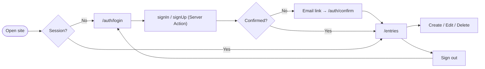

# DailyLog

A small journal app where each user can sign up, write entries, edit them, and
delete them. Each user only sees their own data — enforced by Supabase Row Level
Security, not by application code.

Built as the Capstone project for Claude Code + Skills + Supabase MCP.

## Live URL

**https://dailylog-cyan.vercel.app**

## Stack

- **Next.js 15** (App Router) + TypeScript strict
- **Tailwind CSS** + shadcn/ui (buttons, inputs, cards)
- **`@supabase/ssr`** for cookie-based auth (publishable key only)
- **Supabase Postgres** with RLS for storage
- **Claude Code** + a custom Skill + Supabase MCP for dev-time work
- **Vercel** for hosting

## Architecture







## Local setup

```bash
git clone <repo>
cd dailylog
npm install
cp .env.example .env.local
# fill in NEXT_PUBLIC_SUPABASE_URL and NEXT_PUBLIC_SUPABASE_PUBLISHABLE_KEY
cp .mcp.example.json .mcp.json
# fill in YOUR_PROJECT_REF and YOUR_SUPABASE_PAT (Personal Access Token)
npm run dev
```

Then in the Supabase dashboard:

1. Apply `supabase/migrations/20260509120000_create_entries.sql` (the SQL editor
   or `supabase db push`).
2. Auth → Providers → Email: turn **Confirm email** on.
3. Auth → URL Configuration: set Site URL to your Vercel URL and add both
   `http://localhost:3000` and the Vercel URL to Redirect URLs.

## How Claude Code is wired

Two pieces of plumbing live in the repo:

### 1. `SKILL.md`
Path: `.claude/skills/dailylog-conventions/SKILL.md`.

The Skill encodes the repo's hard rules — the `entries` table shape, the four
RLS policies, that **every write is a Server Action**, that auth uses
`@supabase/ssr` (not the deprecated `auth-helpers-nextjs`), that middleware
refreshes session via `getUser()` (not `getClaims()`), etc. Claude loads the
Skill automatically based on its `description` field whenever a task touches
those triggers.

Verify it's loaded inside `claude`:

```
/skills    # should list dailylog-conventions
```

### 2. `.mcp.json` (gitignored)
Path: `.mcp.json` (local only; commit `.mcp.example.json` instead).

It points Claude Code at this project's Supabase via the official MCP server.
The PAT lives in the `Authorization` header — never in the URL — and the URL
includes `read_only=true` by default. Flip it to `false` only when applying
schema changes, then flip back.

```json
{
  "mcpServers": {
    "supabase-dailylog": {
      "type": "http",
      "url": "https://mcp.supabase.com/mcp?project_ref=YOUR_PROJECT_REF&read_only=true",
      "headers": { "Authorization": "Bearer YOUR_SUPABASE_PAT" }
    }
  }
}
```

Sanity check inside `claude`:

```
/mcp
> List all tables in the database using MCP tools.
```

## Security verification

The most-skipped step in real projects. Run this end-to-end.

1. In Supabase Auth → Users, create two users: `a@test.com` and `b@test.com`.
   Confirm both via the magic-link email.
2. Sign in as user **A** in the app, create one entry titled `secret-A`.
3. Open an incognito window. Sign in as user **B**.
4. **Expected:** the `/entries` list for B is empty (no `secret-A`).
5. As an extra check, in Supabase SQL editor under "Run as user B":

   ```sql
   select * from entries;
   ```

   Expected result: `0 rows`.

If user B can see user A's row at any layer, RLS is broken — re-apply the
migration and confirm

```sql
select policyname, cmd from pg_policies where tablename = 'entries';
```

returns four policies all using `(auth.uid() = user_id)`.

## What I'd do next

- **Tags + filters.** Add a `tags text[]` column and a tag chip filter on
  `/entries`.
- **Markdown rendering.** The `body` field is plain text today; render it with
  `react-markdown` and add a preview toggle.
- **Soft delete + undo.** Replace `delete` with a `deleted_at` column so the
  delete button can show a 5-second undo toast (and update the RLS select
  policy to `deleted_at is null`).
